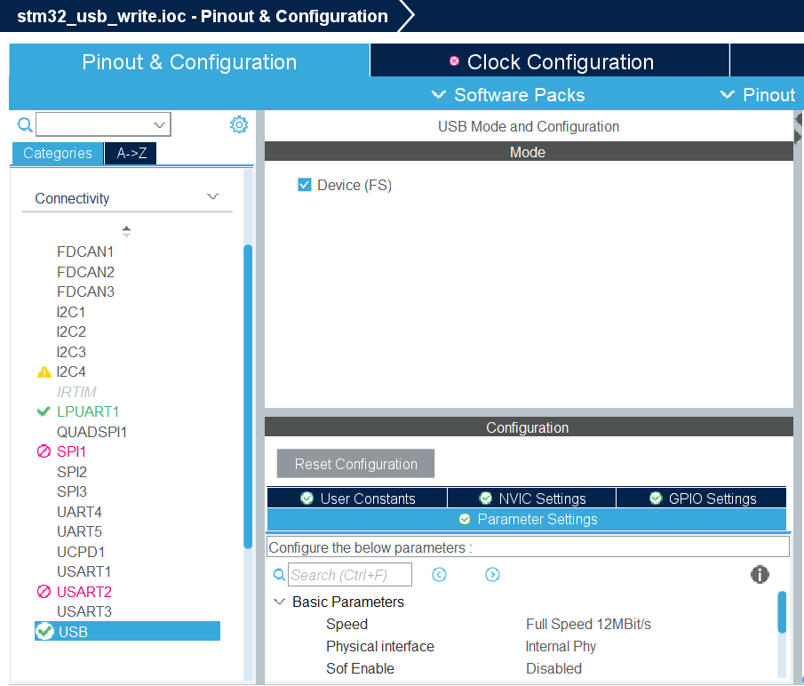
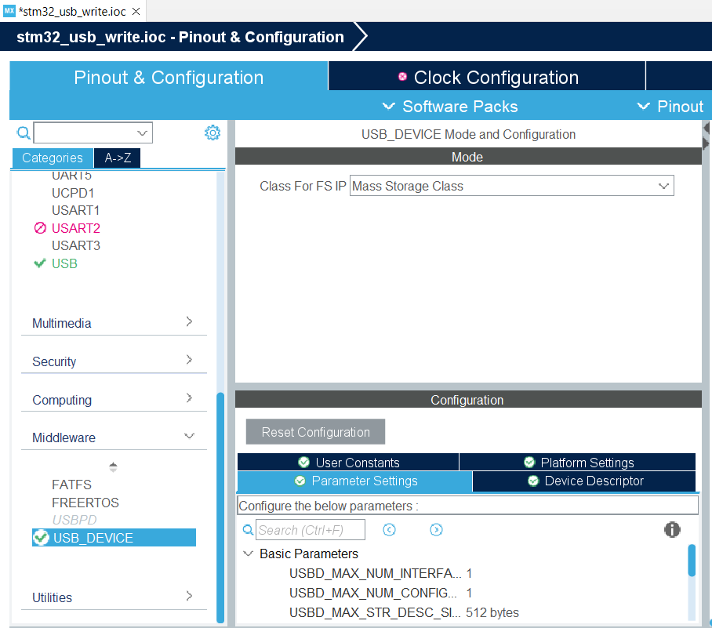
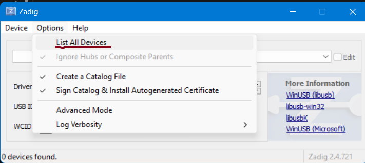
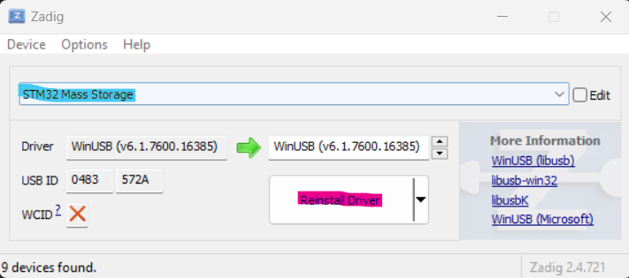

# STM32 USB FS Data Transfer Example

This repository contains an example demonstrating how to use the STM32 USB library to transfer data from an MCU to a PC. In this setup, a maximum transfer speed of **770 kB/s** was achieved. Data is sent one-way, from the MCU to the PC, with the `pyusb` Python module used for reading data on the PC.

The actual speed may vary depending on your system configuration (OS, PC, etc.), so there is no guarantee you will achieve the same results.

## STM32 Code Setup

This example uses the **NUCLEO G474RE** development board, but the specific board should not matter much, as most of the setup is done via the STM32CubeIDE's **Device Configuration Tool**. Follow these steps to set up the project:

1. **Enable USB FS** on the MCU using the Device Configuration Tool in STM32CubeIDE. Leave the default parameters unchanged.


2. Set the USB class to **Mass Storage**, without changing any other parameters. (Note: I attempted using CDC, but the transfer speeds were unsatisfactory.)


3. The above steps are implemented in the first commit of this repository. Therfore the first commit contains only machine-generated code, so by comparing it with the second commit, you can easily identify the code added by "the user".
4. **Add the following code** into the main infinite loop of `main.c`. Ensure the necessary variables are defined, and include the required header file `usbd_msc.h` . Check the changes in the second commit.
5. The **transfer complete flag** is set in the `usbd_conf.c` file (check the second commit for reference).

Here’s the relevant code for the main loop:

```c
while (1)
{
  if (startCommunication) {
    uint32_t sample = 0;
    startCommunication = 0;

    while (txCnt) {
      txCnt--;

      for (int i = 0; i < sizeof(usbData); i = i + 4) {
        // Parsing 32-bit "sample" into 8-bit chunks
        usbData[i] = sample >> 24 & 0xFF;
        usbData[i+1] = sample >> 16 & 0xFF;
        usbData[i+2] = sample >> 8 & 0xFF;
        usbData[i+3] = sample & 0xFF;
        sample++;
      }

      flagBulkInTx = 0;
      USBD_LL_Transmit(&hUsbDeviceFS, MSC_EPIN_ADDR, usbData, 1024);
      while (!flagBulkInTx);
    }
  }
  /* USER CODE END WHILE */

  /* USER CODE BEGIN 3 */
}
/* USER CODE END 3 */
```
6. **Connect the STM32 USB peripheral to the PC** using a USB cable. I only connected three wires: **DATA+**, **DATA-**, and **GND**.
7. **Set the compiler optimization** to **optimize for speed** (without this, the transfer speed was limited to **600 kB/s**).
8. At this point, the STM32 MCU should be detected as a Mass Storage device in the Device Manager when connected via a USB cable.

## Additional Notes

The code is designed to run through the debugger. You will need to manually set the following variables:

- **`txCnt`**: The number of kilobytes to transfer.
- **`startCommunication`**: A flag to start the transfer.

The data being transmitted consists of incremented 32-bit integers, which can also be used to verify data integrity.

## PC Setup

On the PC side, we will read data using Python and the PyUSB module (for this module to work, you also need the `libusb1.0.dll` library, which is included in this repository). To use the Python scripts in this repository, you need to install two packages: PyUSB and Matplotlib. The latter is used only for checking the data integrity of your USB connection.

```bash
pip install pyusb matplotlib
```

Another requirement is to install the drivers that will work with PyUSB/libusb1.0.dll. For this, I used **Zadig**, which can be downloaded [here](https://zadig.akeo.ie/). The pictures below describe the procedure, use the **WinUSB** driver for the STM32 mass storage.

 


## Running the Program

Upload the STM32, and via the Live Expressions tab in the debugger view, set `TxCnt` to 10000 (we will send 10MB of data) and the `startCommunication` variable to 1. As the Python script is not yet running, the USB data won't be flowing. Then, run the `STM32_USB_read.py` script. After a while, 10MB of data should be received, and the transfer speed will also be printed.

It is necessary to check the data integrity by running the `USB_data_check.py` script.

This is a basic program for achieving what I would call a decent speed for the STM32 USB FS device. If anyone has any ideas on how to speed up the transfer, any tips and tricks are most welcome.

Hope this helps anyone!

